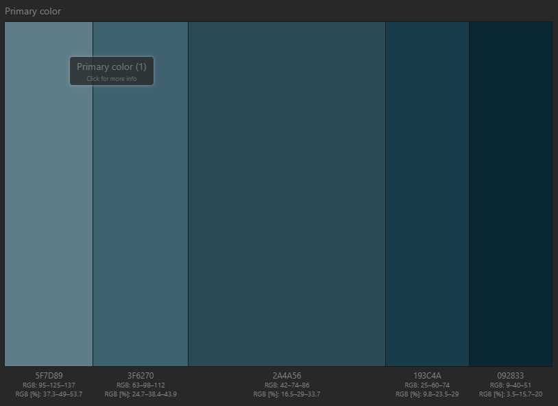
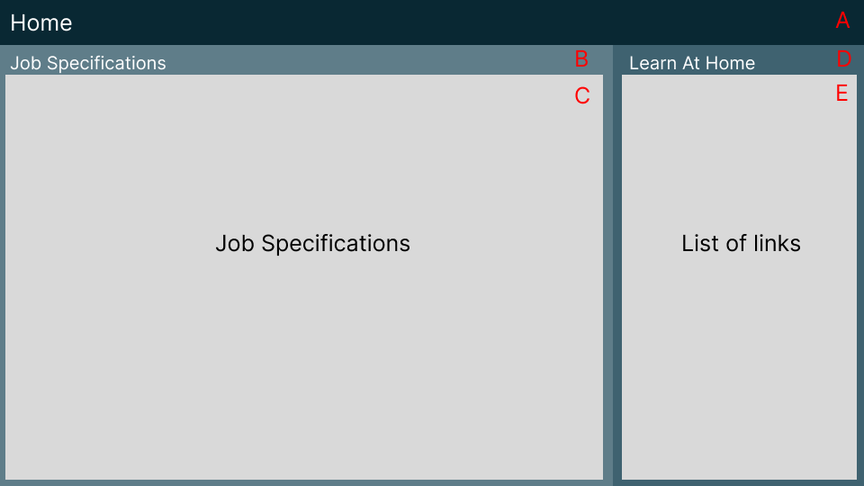
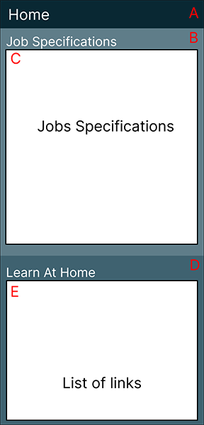

# Unit 15

[[toc]]

## Assignment 2

## Requirements

### Client Requirements

+ Have a company profile
+ Have profiles of existing trainee web developers
+ Job specifications and required qualifications
+ An online application form
+ Have links to web development courses

### User Requirements

+ A website that is accessible
+ A website that is easy to use and understand
+ A website that is easy to navigate
+ A website that is responsive
+ A website that loads within a couple seconds 

### Developer requirements

+ Code needs to be easy to understand
+ Code needs to be easy to maintain

## Design

### Target Audience

People who have completed training courses or qualifications related to web development and are now looking for a job as a web developer.

### Colour Scheme

[Paletton](https://paletton.com/#uid=13q0u0kh5hca9roeDmlmgeJriag)

+ #2A4A56
+ #5F7D89
+ #3F6270
+ #193C4A
+ #092833

I felt like this colour choice was a good choice because blue is considered

### Typography

I will be using Arial, Helvetica, sans-serif in that order of priority. I will be using Arial because it is easy to read, versatile because of the various weights it has, making it more accessible, meeting requirements, and because it is a web safe font meaning it comes pre installed on machines. Helvetica is the second priority because it is similar to Arial, It is easy to read and versatile, and it is a web safe font. Sans-serif also has the same advantages to Areal and Helvetica.

## Storyboards

### Company Profile alternative Design

### Company Profile Design

#### A

+ Bootstrap navigation bar
+ #092833
+ Width 100% Height 56 pixels

#### B

+ #3F6270

#### C

#### D

#### E

All text will use the Arial font and should it not be available the Helvetica, or sans-serif fonts.

I decided to go with design two for my website because for the first design I would have had to create a separate page for the staff according to client requirements.

### Selected Company Profile Mobile

.png>)

### Join us/Job Spec Page First Design

### Join us/Job Spec Page Mobile Design

### Application Form

## Testing

### Functionality & Compatibility Testing

To test my website I will make sure all my links, buttons and interactive features work. To do this once I will go through and check all links, buttons and interactive features and record the results.

### Functionality & Compatibility Testing Results

### Usability Testing

### Form Validation

## Optimisations

### Before

### After

## Evaluation

## References

https://colorlib.com/wp/website-color-statistics/ - colour statistics
https://marketsplash.com/color-psychology-statistics/#link4 - colour statistics